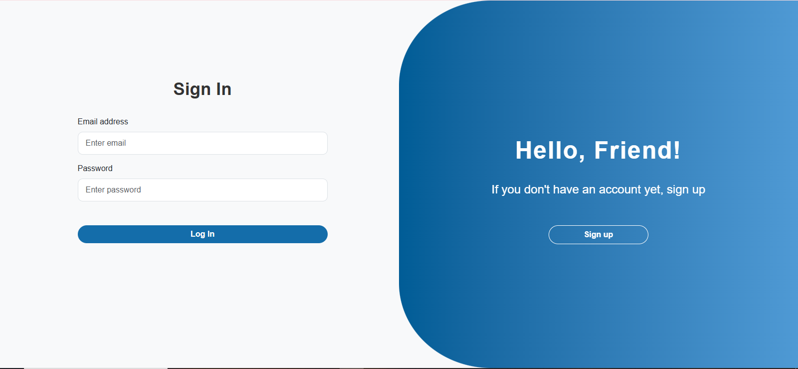

# Registration Form

A sleek, modern authentication system with smooth transitions and form validation. Built with HTML, CSS, Bootstrap, and JavaScript.

## Features

- **Dual Authentication**: Seamless login and signup forms with smooth transitions
- **Modern UI**: Clean, gradient-based design with elegant animations
- **Form Validation**: Comprehensive client-side validation with real-time feedback
- **Smooth Animations**: Elegant slide transitions between forms and states
- **Local Storage**: User accounts persist between browser sessions
- **Responsive Design**: Optimized for all device sizes with adaptive layouts
- **Toast Notifications**: Beautiful success and error feedback system
- **Loading States**: Visual feedback during form submissions
- **Secure Logout**: Complete session management with smooth transitions

## Live Demo

[View Live Demo](https://dohahehe.github.io/registration-form/)

# Screenshots

## Signup View

## Login View

## Welcome View

  
## Technologies Used

- **Frontend**: HTML5, CSS3, Bootstrap 5, JavaScript (ES6+)
- **Icons**: Font Awesome
- **Storage**: Browser Local Storage
- **Animations**: CSS Transitions and Transformations
